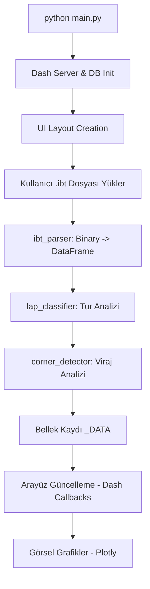

# iRacing Telemetry Analytics — Teknik Çalışma Akışı (ARCHITECTURE.md)

Bu döküman, uygulamanın `python main.py` (veya `app.py`) komutuyla başlatılmasından itibaren verinin nasıl işlendiğini ve arayüze nasıl yansıdığını adım adım açıklar.

---

## 1. Başlatma ve Giriş Noktası (Entry Point)

Uygulama iki şekilde başlatılabilir:
1.  **Geliştirme Modu**: `python app.py` (veya `python main.py`) doğrudan terminalden çalıştırılır.
2.  **Masaüstü Modu (Electron)**: `electron .` komutu `electron/main.js` dosyasını tetikler. Bu dosya arka planda Python sunucusunu (`app.py`) başlatır ve Dash arayüzünü bir pencere içinde sunar.

### Başlangıç Adımları:
- **`app.py`**: Dash uygulamasını (`dash.Dash`) başlatır.
- **`db_init()`**: SQLite veritabanını (`iracing_sessions.db`) hazırlar.
- **`create_layout()`**: `ui/layout.py` üzerinden ana kullanıcı arayüzü iskeletini oluşturur.

---

## 2. Veri Yükleme ve İşleme Hattı (Data Pipeline)

Kullanıcı bir `.ibt` dosyasını sürükleyip bıraktığında veya seçtiğinde şu süreç başlar:

### A. Dosya Okuma (`core/ibt_parser.py`)
- `IBTFile` sınıfı, iRacing'in binary formatındaki telemetri verilerini okur.
- Ham veriler bir Pandas **DataFrame** yapısına dönüştürülür.
- Frekans düşürme (Downsampling) yapılarak tarayıcı performansı optimize edilir.

### B. Tur Sınıflandırma (`core/lap_classifier.py`)
- Yüklenen veri içindeki turlar; *Best Lap*, *In-lap*, *Out-lap*, *Invalid* veya *Safety Car* olarak etiketlenir.
- Tur süreleri (`LapTime`) hesaplanır.

### C. Viraj Tespiti (`core/corner_detector.py`)
- Pist verisi (Track position) ve G-Force verileri kullanılarak pistteki virajlar otomatik olarak tespit edilir.
- Pist "Sektör" ve "Viraj" bölümlerine ayrılarak analiz için hazır hale getirilir.

---

## 3. Klasör Yapısı (Project Structure)

- **`/core`**: Veri işleme motoru (Parser, Detector, Classifier).
- **`/services`**: Veritabanı, PDF üretimi ve AI servisleri.
- **`/ui`**: Dash bileşenleri, layout ve callback mantığı.
- **`/plotting`**: Plotly grafik şablonları (GPS haritaları, bindirmeler).
- **`/assets`**: CSS, resimler ve statik dosyalar.
- **`/electron`**: Masaüstü uygulama paketleme dosyaları.

---

## 4. Servis Katmanı (Services)

Uygulamanın zekası ve kalıcılığı bu katmanda yönetilir:

- **`services/database.py`**: Oturum verilerini, en iyi turları ve araç kurulumlarını (Setup) SQLite veritabanına kaydeder/yükler.
- **`services/telemetry_service.py`**: Veriler üzerinde ileri düzey hesaplamalar (Slip angle, Trail braking score vb.) yapar.
- **`services/pdf_report.py`**: Mevcut analizi profesyonel bir PDF raporuna dönüştürür.
- **`services/ai_feedback.py`**: Telemetri verilerini analiz ederek sürücüye yapay zeka destekli geri bildirim sağlar.

---

## 5. Arayüz ve Görselleştirme (UI/Plotting)

Uygulama sekmeli (Tab-based) bir yapıdadır:

- **`ui/tabs/`**: Her bir analiz sayfası (Overview, Dynamics, Brakes vb.) kendi modülünde tanımlıdır.
- **`plotting/`**: Plotly kütüphanesi kullanılarak oluşturulan grafikler (GPS Map, Overlays, Brake Shapes) burada merkezi olarak yönetilir.
- **Callbacks (`ui/callbacks/`)**: Kullanıcı etkileşimlerini (buton tıklamaları, sekme geçişleri) yöneten Dash callback'leri.

---

## 6. Bellek Yönetimi

Uygulama, yüklü olan telemetri verilerini sunucu tarafında global bir `_DATA` sözlüğünde tutar. Bu sayede sekmeler arası geçiş yapıldığında verinin her seferinde yeniden yüklenmesine gerek kalmaz, sadece görselleştirme katmanı güncellenir.

---

## Özet Akış Diyagramı (Mermaid)

