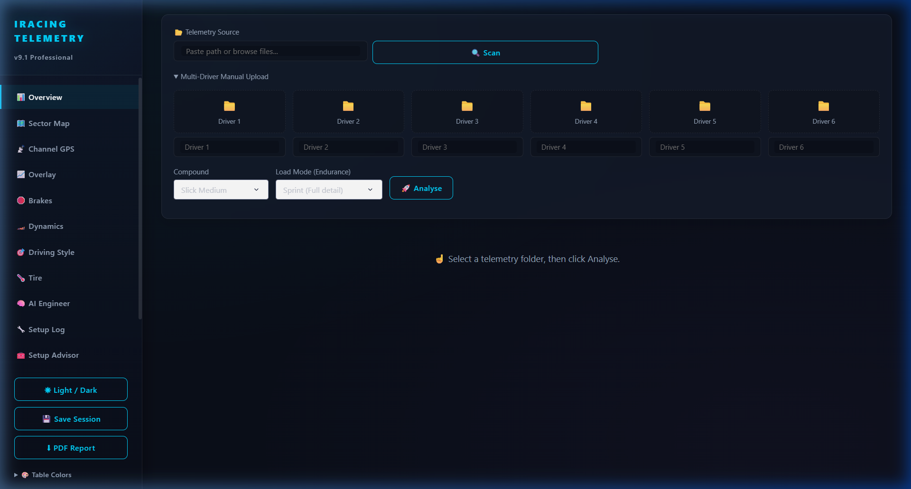

# iRacing Telemetry Analytics



A professional-grade, real-time telemetry analysis platform for **iRacing** simulation racing. Load `.ibt` telemetry files, analyze your driving data with advanced physics calculations, and get AI-powered feedback — all through an interactive web dashboard.

> **Built with:** Python · Plotly Dash · SQLite · scikit-learn · ReportLab

---

## Features

- **`.ibt` File Parser:** Reads iRacing's binary telemetry format and converts it into structured Pandas DataFrames.
- **Lap Classification:** Automatically categorizes laps as *Best Lap*, *In-lap*, *Out-lap*, *Invalid*, or *Safety Car* lap.
- **Corner & Sector Detection:** Uses track position and G-Force data to automatically detect corners and divide the circuit into sectors.
- **Advanced Telemetry Metrics:** Calculates slip angle, trail braking score, throttle application points, and more.
- **Tire Analysis:** Deep dive into tire behavior, temperature distribution, and degradation patterns across a stint.
- **Anomaly Detection:** Identifies unusual data patterns (e.g., lock-ups, spins) automatically.
- **Setup Advisor:** Provides data-driven car setup recommendations based on telemetry evidence.
- **AI-Powered Feedback:** Analyzes driving telemetry and delivers coaching feedback to help improve lap times.
- **Interactive Dashboard (Dash/Plotly):** Multi-tab interface for Overview, Dynamics, Brakes, Tires, and GPS Map views.
- **PDF Report Export:** Generates professional session reports with charts and analysis.
- **Desktop App (Electron):** Can be packaged as a standalone desktop application.

---

## Architecture

```
iracingf1/
├── main.py                # Entry point
├── app.py                 # Dash application & server
├── config.yaml            # Application configuration
├── core/
│   ├── ibt_parser.py      # Binary .ibt file reader → DataFrame
│   ├── lap_classifier.py  # Lap type detection & timing
│   ├── corner_detector.py # Corner & sector segmentation
│   ├── telemetry_metrics.py # Advanced physics calculations
│   ├── tire_analysis.py   # Tire behavior analysis
│   └── anomaly_detector.py # Anomaly detection
├── services/
│   ├── database.py        # SQLite session persistence
│   ├── telemetry_service.py # High-level data processing
│   ├── pdf_report.py      # PDF report generation
│   ├── setup_advisor.py   # Car setup recommendations
│   └── ai_feedback.py     # AI coaching feedback
├── ui/                    # Dash layout & callbacks
├── plotting/              # Plotly chart templates (GPS, overlays)
├── assets/                # CSS, images, static files
└── electron/              # Desktop app packaging
```

---

## Setup & Installation

### Prerequisites
- Python 3.9+
- An iRacing subscription (for `.ibt` telemetry files)

### Install

1. Clone the repository:
   ```bash
   git clone https://github.com/UmutSemihSoyer/iracing-telemetry-analytics.git
   cd iracing-telemetry-analytics
   ```

2. (Recommended) Create and activate a virtual environment:
   ```bash
   python -m venv venv
   venv\Scripts\activate   # Windows
   source venv/bin/activate # macOS/Linux
   ```

3. Install dependencies:
   ```bash
   pip install -r requirements.txt
   ```

---

## Usage

### Run the Dashboard

```bash
python main.py
```

Then open your browser and navigate to: **`http://127.0.0.1:8050`**

### Load a Telemetry File

1. In the dashboard, use the **file upload area** to drag & drop or select an `.ibt` file.
   - iRacing saves telemetry files to: `Documents\iRacing\telemetry\`
2. The app will automatically parse the file, classify laps, and populate all analysis tabs.

### Where to Find `.ibt` Files

iRacing must have **telemetry logging enabled** in-game:
- Go to **Options → Sports → Enable Disk Logging**
- After a session, your `.ibt` files will be in: `C:\Users\<YourName>\Documents\iRacing\telemetry\`

---

## License

MIT License — see [LICENSE](LICENSE) for details.
